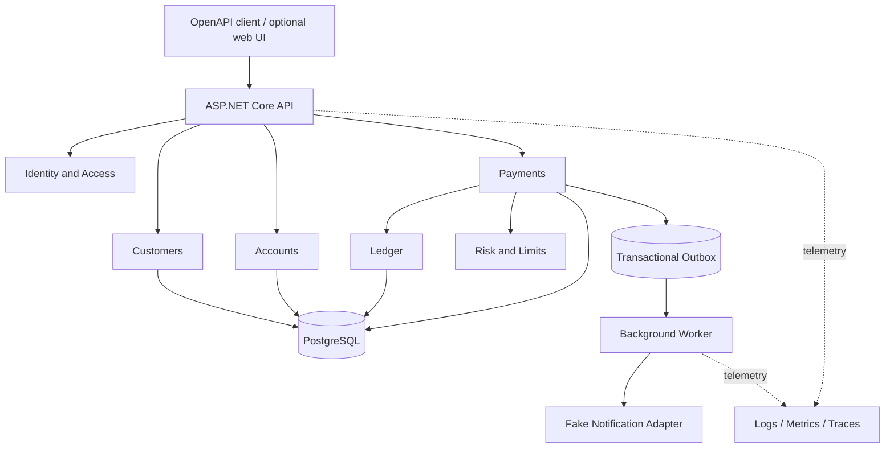

# Fintech Backend Lab

> A backend-first, hands-on learning project built with ASP.NET Core 10 and PostgreSQL.

**Current status:** Product and architecture baseline documented. No application code has been created yet.

This repository will contain a simulated digital-wallet and internal-payments platform. Its purpose is to help me rebuild my .NET knowledge, practise production-minded backend engineering, and prepare for technical interviews by writing and explaining every important part myself.

This is an educational sandbox. It does not move real money, connect to a bank, perform real KYC/AML checks, or store real cardholder or personal data.

## Contents

- [Design documentation](#design-documentation)
- [What fintech means](#what-fintech-means)
- [What this application will do](#what-this-application-will-do)
- [Do I need a frontend?](#do-i-need-a-frontend)
- [Scope](#scope)
- [Architecture decision](#architecture-decision)
- [Modules and responsibilities](#modules-and-responsibilities)
- [Non-negotiable financial rules](#non-negotiable-financial-rules)
- [Technology choices](#technology-choices)
- [Engineering working agreement](#engineering-working-agreement)
- [Planned API](#planned-api)
- [Step-by-step roadmap](#step-by-step-roadmap)
- [Testing strategy](#testing-strategy)
- [Technical interview track](#technical-interview-track)
- [Definition of Done](#definition-of-done)
- [Public GitHub checklist](#public-github-checklist)
- [The first working session](#the-first-working-session)
- [Learning rules](#learning-rules)
- [Official references](#official-references)

## Design documentation

The detailed Version 1 design is maintained outside this roadmap so product, architecture, data, security, and decisions can evolve independently:

- [Documentation index](docs/README.md)
- [Product brief](docs/product-brief.md)
- [Domain and architecture glossary](docs/glossary.md)
- [Quality attributes and fitness functions](docs/quality-attributes.md)
- [Software architecture](docs/architecture/software-architecture.md)
- [Data architecture](docs/architecture/data-architecture.md)
- [Security architecture and threat model](docs/architecture/security-architecture.md)
- [Architecture diagrams](docs/architecture/diagrams.md)
- [Architecture Decision Records](docs/adr/README.md)

These documents are an implementation baseline, not proof that the application exists. Before coding a phase, I will read the relevant design, challenge it, rewrite anything I cannot explain, and record material changes in an ADR.

The active database decision is [ADR 0006 — PostgreSQL and Npgsql](docs/adr/0006-use-postgresql-and-npgsql.md). Earlier engine-specific decisions are historical; application code and migrations have not been created.

**Ready to implement?** Follow [01 — Create the project foundation yourself](docs/tutorials/01-project-foundation.md) for the solution structure, commands, complete reference snippets, and verification steps. You create and run the application yourself; the guide does not mean those files already exist.

## What fintech means

**Fintech** means using software to provide or improve financial services. Examples include payments, digital wallets, banking, lending, investing, insurance, fraud detection, budgeting, and financial reporting.

A **fintech backend** is the server-side system behind those experiences. It typically:

- authenticates users and checks what they are allowed to do;
- owns accounts, balances, transfers, and transaction history;
- enforces financial rules and limits;
- writes financially important changes atomically;
- prevents duplicate requests and conflicting updates;
- keeps an immutable audit trail;
- protects sensitive data;
- integrates with payment providers, banks, queues, and notification systems;
- exposes APIs to web, mobile, partner, and operations clients;
- produces logs, metrics, and traces so failures can be investigated.

The difficult part is not creating CRUD endpoints. It is guaranteeing that the same request, a retry, a timeout, or two simultaneous requests cannot silently create or destroy money.

## What this application will do

The project will be a **digital-wallet and internal-transfer sandbox**. All users, identity documents, funds, and payment providers will be fictional.

### Main user journey

1. A customer registers and signs in.
2. The customer completes a simulated onboarding/KYC process.
3. The customer opens a wallet in one supported fiat currency.
4. A sandbox operation adds test funds to the wallet.
5. The customer sends money to another active wallet.
6. The system records a balanced, immutable journal entry.
7. Both customers can see the transfer and their account statements.
8. An authorized operator can inspect audit history and reverse an eligible transfer with a compensating entry.

### Why this is a strong interview project

This single product creates realistic reasons to discuss:

- domain modeling and invariants;
- REST API design and HTTP semantics;
- authentication versus authorization;
- object-level access control;
- SQL design, constraints, indexes, and execution plans;
- EF Core change tracking and query performance;
- transactions and isolation levels;
- optimistic concurrency and race conditions;
- idempotency and safe retries;
- double-entry accounting;
- synchronous versus asynchronous workflows;
- outbox/inbox patterns and at-least-once delivery;
- unit, integration, concurrency, security, and load tests;
- logs, metrics, traces, health checks, and incident debugging;
- Docker, CI/CD, cloud deployment, rollback, and architectural trade-offs.

## Do I need a frontend?

**No frontend is required for the first backend release.**

Use the generated OpenAPI document and Scalar as the first interactive API reference and explorer. Do not add Postman, Bruno, or another separate GUI API client initially. Scalar is sufficient for learning and demonstrations; automated functional and integration tests prove repeatable behavior. Add version-controlled `.http` requests later only if they solve a demonstrated need.

Add a small frontend only after the API, ledger, security, tests, and deployment are credible. The optional UI should demonstrate the system rather than become a second large project. It can contain sign-in, wallets, send-money, statement, and operator-audit screens.

## Scope

### Version 1 scope

- customer registration and authentication;
- simulated KYC status;
- one customer owning one or more fiat wallets;
- TRY, USD, and EUR as sandbox currencies;
- sandbox deposits, internal transfers, and reversals;
- double-entry ledger as the financial source of truth;
- idempotent money-moving requests;
- account statements with cursor pagination;
- role/policy and resource-owner authorization;
- audit records;
- notification events processed asynchronously;
- tests, observability, CI, containers, and a public demo deployment.

### Explicitly out of scope for Version 1

- real money or bank connections;
- real card numbers or card processing;
- real identity documents, biometrics, or PII;
- real KYC, AML, sanctions, tax, or regulatory compliance;
- loans, interest, investments, cryptocurrency, and foreign exchange;
- cash withdrawal, chargebacks, and external bank settlement;
- mobile applications;
- Kubernetes;
- multiple independently deployed microservices;
- claims that the system is production-ready or legally compliant.

If cardholder data is ever introduced, the system enters PCI DSS scope. That is intentionally avoided; a future provider integration must use the provider's sandbox and tokens instead of storing card details.

## Architecture decision

Start with a **modular monolith**, organized by **business module** and **vertical use case**, with **Clean Architecture dependency direction** and selective **DDD** for financial rules.

These terms solve different problems:

| Concept | Its job in this project |
|---|---|
| Modular monolith | Defines business-module boundaries while keeping one deployable application. |
| Vertical slice | Keeps each use case's endpoint, request, validation, handler, and response close together. |
| Clean Architecture | Keeps domain/application rules from depending on PostgreSQL, HTTP, queues, or cloud vendors. |
| DDD | Models only the genuinely complex rules, such as money, ledger entries, transfers, limits, and reversals. |

Do not begin with microservices. A distributed system would add network failures, eventual consistency, deployment coordination, and operational cost before the domain boundaries are understood. A well-separated monolith lets those boundaries be learned first and still creates a credible extraction path later.



### Planned solution shape

This is a target, not a command to create every project on day one.

```text
FintechBackendLab.slnx
src/
  FintechBackend.Api/                 # HTTP boundary and composition root
  FintechBackend.BuildingBlocks/      # Very small shared primitives only
  Modules/
    Customers/FintechBackend.Customers/
    Accounts/FintechBackend.Accounts/
    Ledger/FintechBackend.Ledger/
    Payments/FintechBackend.Payments/
    Risk/FintechBackend.Risk/
    Notifications/FintechBackend.Notifications/
tests/
  FintechBackend.UnitTests/
  FintechBackend.IntegrationTests/
  FintechBackend.ArchitectureTests/
  FintechBackend.FunctionalTests/
  docs/
    adr/                                # Architecture Decision Records
    diagrams/
    runbooks/
    postmortems/
```

Each module can begin as one project with internal `Domain`, `Application`, `Infrastructure`, and `Features` areas. Split a module into more assemblies only when a real dependency problem justifies it. Do not create dozens of empty projects to look enterprise-ready.

## Modules and responsibilities

| Module | Owns | Must not own |
|---|---|---|
| Identity and Access | Credentials, claims, roles, authentication configuration | Wallet balances or transfer rules |
| Customers | Customer profile and simulated KYC status | Credentials or ledger postings |
| Accounts | Wallet lifecycle, ownership, status, and supported currency | Transfer workflow or journal internals |
| Ledger | Ledger accounts, journal entries, postings, and financial balances | HTTP contracts or notification delivery |
| Payments | Transfer state machine, idempotency, orchestration, and reversals | Direct edits to posted ledger history |
| Risk and Limits | Transfer limits and simple risk decisions | Authentication or accounting truth |
| Notifications | Email/SMS-like messages through fake adapters | Deciding whether a transfer succeeds |
| Reporting | Read-only projections and statements | Writing financial source-of-truth data |

Prefer a schema and an EF Core `DbContext` per important module inside one PostgreSQL database. Map schemas explicitly and keep each context's migration history separate. A module owns its tables; another module should not casually query or update them. Cross-module interaction begins with explicit application contracts and can later move to events where that is useful. Schemas are logical namespaces, not automatic security isolation.

## Non-negotiable financial rules

Write these rules before implementation and encode them in both the domain and database where possible.

1. Money is never represented with `float` or `double`.
2. Version 1 stores fiat amounts as integer minor units plus an ISO currency code.
3. An amount must be positive unless the specific type explicitly models a signed accounting value.
4. A wallet has exactly one currency.
5. A Version 1 transfer cannot cross currencies.
6. The source and destination wallets must be active and different.
7. A customer cannot spend another customer's money.
8. Overdrafts are not allowed in Version 1.
9. Every posted journal entry has at least two postings.
10. Total debits equal total credits for each journal entry and currency.
11. Posted journal entries are immutable. Corrections use new compensating entries.
12. Balance is derived from ledger postings; any cached balance must be reconcilable with the ledger.
13. Transfer creation, ledger posting, idempotency result, audit record, and outbox message commit in one database transaction where the design requires them to succeed together.
14. Repeating the same request with the same idempotency key and payload returns the original result and never moves money twice.
15. Reusing an idempotency key with a different payload is rejected.
16. Concurrent requests cannot overspend a wallet.
17. Every important timestamp is an unambiguous UTC instant, and time-dependent rules are testable through `TimeProvider`.
18. Logs never contain passwords, tokens, identity documents, full account secrets, or other sensitive values.

Create a short accounting note before building the ledger. Be able to explain assets, liabilities, debit, credit, journal entries, postings, available balance, pending balance, settlement, and reversal in this product's context.

## Technology choices

### Use from the beginning

| Area | Choice | Reason |
|---|---|---|
| Runtime | .NET 10 LTS and C# 14 | Current long-term-support .NET generation and the requested target. |
| API | ASP.NET Core 10 Web API with controllers | Strong interview coverage and explicit HTTP boundaries; Minimal APIs will be compared later in an ADR. |
| API contract | Built-in ASP.NET Core OpenAPI and Problem Details | Discoverable contracts and consistent errors. |
| API reference | Scalar for ASP.NET Core | Modern interactive documentation over the built-in OpenAPI document without introducing a second document generator. |
| Database | PostgreSQL 18, supported patched release | Selected relational database for transactions, constraints, module schemas, MVCC, and query-plan practice. |
| Data access | EF Core 10 with `Npgsql.EntityFrameworkCore.PostgreSQL` 10.x | PostgreSQL mapping, migrations, transactions, and optimistic-concurrency support; pin compatible stable package versions. |
| Database tools | pgAdmin 4 and `psql` | Graphical administration plus command-line database practice; neither replaces the PostgreSQL server. |
| Tests | xUnit, ASP.NET Core test host, and PostgreSQL integration tests | Separates fast business tests from real persistence/API verification. |
| Logging | `Microsoft.Extensions.Logging` structured logs | Start with framework abstractions and avoid sensitive log data. |
| Source control | Git and a public GitHub repository | Visible history, issues, pull requests, and CI evidence. |

Use nullable reference types, analyzers, formatting rules, warnings-as-errors in CI, central package management, locked dependency restore, and a pinned SDK through `global.json`.

### Add only when the roadmap reaches the need

- Docker and Docker Compose for repeatable local and deployment environments;
- `Testcontainers.PostgreSql` for isolated real PostgreSQL integration tests, with a pinned PostgreSQL 18 image shared by local/CI verification;
- OpenTelemetry for logs, metrics, and traces;
- a background `WorkerService` and transactional outbox;
- RabbitMQ only after the outbox and delivery semantics are understood;
- Redis only after a measured caching or distributed-coordination need exists;
- Aspire after the API, database, worker, and supporting containers become inconvenient to run separately;
- a standards-based external identity provider when learning OAuth 2.0/OpenID Connect and MFA;
- a small React/Next.js or Blazor frontend after the backend release candidate.

### Avoid initially

- microservices, Kubernetes, event sourcing, service mesh, and distributed transactions;
- a generic repository wrapping every EF Core operation;
- MediatR, AutoMapper, or a large package stack before understanding the problem each package solves;
- in-memory databases or SQLite as proof that PostgreSQL behavior works;
- database triggers containing hidden business workflows;
- exposing EF entities directly as API contracts;
- fake badges, fake coverage numbers, or a “production-ready” claim.

### Local environment already observed

- .NET SDK `10.0.400` is installed.
- .NET/ASP.NET Core runtime `10.0.11` is installed.
- No `global.json` exists yet.
- The folder was empty and was not a Git repository when this roadmap was created.

PostgreSQL and pgAdmin installation have not been verified. pgAdmin is a database client, not the database engine. Before the persistence phase, verify a PostgreSQL 18 service or container and a successful `psql`/pgAdmin connection. The .NET observations above are the original setup snapshot, not a fresh machine audit.

## Engineering working agreement

This agreement governs implementation and review unless a later ADR changes a decision with evidence.

### Current, stable, and intentional technology

- Target .NET 10 LTS, ASP.NET Core 10, EF Core 10, and C# 14 using stable, supported releases. Do not use preview packages in the main branch.
- Target PostgreSQL 18 with the Npgsql EF Core 10.x provider. Pin exact supported package and database-image versions when implementing; keep local, CI, and deployment behavior aligned and adopt security updates through tested changes.
- Pin the SDK with `global.json`; manage package versions centrally when external dependencies begin; use repeatable, locked restores in CI.
- Prefer the platform and standard library before adding a dependency. Every package must solve a named problem, be maintained, have an acceptable license and security posture, and be removable without rewriting the domain.
- “Newest” is not a sufficient reason for a technology choice. Adopt a tool only when its support lifecycle, operational cost, security implications, and learning value are understood.
- Keep built-in ASP.NET Core OpenAPI as the source of truth. Scalar only renders and explores that contract; it must not become a second contract or a substitute for automated tests.
- Expose Scalar and the runtime OpenAPI endpoint only in Development by default. Disable optional Scalar agent functionality, never prefill credentials, and never place tokens or secrets in API-reference configuration.
- Do not add Swagger/Swashbuckle, Postman, Bruno, or another overlapping API tool unless a documented requirement justifies it.

### Security and financial correctness

- Treat security as a continuous engineering process supported by threat models, tests, reviews, dependency scanning, observable evidence, and incident exercises—not as a one-time feature or an unsupported “completely secure” claim.
- Apply secure defaults, least privilege, deny-by-default authorization, defense in depth, explicit resource ownership, strict input bounds, safe error responses, HTTPS, rate limits, auditability, and secret redaction.
- Never commit or use real money, credentials, tokens, personal data, identity documents, card data, production exports, or realistic secrets. All public examples and seeded records must be obviously fictional.
- Do not invent authentication, cryptography, password storage, or token protocols. Use established framework facilities and standards-based providers when the relevant phase is reached.
- Financial correctness is a security boundary. Ledger balance, immutability, transaction atomicity, idempotency, concurrency control, authorization, and reconciliation require both application tests and database-level protection where applicable.
- Treat logs, traces, metrics, health responses, validation errors, and OpenAPI examples as possible disclosure paths. Minimize and sanitize them deliberately.
- Pin and review dependencies, enable automated vulnerability and secret scanning, and apply security updates through a tested pull request. A passing scanner does not prove the application is secure.
- Publish limitations and known security gaps honestly. This sandbox must never claim regulatory compliance or production readiness.

### Clean, extensible, and team-maintainable design

- Optimize first for correctness and clarity, then for extensibility and performance supported by a real requirement or measurement.
- Use SOLID principles as design review questions, not as a reason to create interfaces, layers, factories, or abstractions for every class.
- Preserve modular-monolith boundaries and Clean Architecture dependency direction. Keep business rules independent from HTTP, EF Core, Npgsql, PostgreSQL, queues, and UI concerns.
- Organize delivery around small vertical slices. Each slice owns an explicit contract, validation, authorization, transaction boundary, tests, telemetry, and documentation.
- Prefer cohesive types, intention-revealing names, explicit behavior, small public APIs, immutable financial concepts, and dependencies visible through constructors. Avoid hidden side effects and speculative reuse.
- Share code only when the same stable concept is genuinely shared. Some duplication is cheaper than coupling unrelated modules through a premature abstraction.
- Enforce formatting, nullable analysis, analyzers, dependency rules, warnings-as-errors in CI, and deterministic builds. Suppress a warning only with a documented reason.
- Record significant choices and rejected alternatives in ADRs. Keep pull requests small enough to review and commits meaningful enough to understand or revert.
- Design as if another engineer will maintain the feature next month: document the reason behind non-obvious decisions, provide a repeatable setup, and make failures diagnosable.

### Public portfolio and learning ownership

- Keep repository status, supported features, test evidence, benchmarks, deployment state, and known gaps accurate. Do not publish decorative claims, badges, or diagrams that are not backed by the repository.
- Make a clean clone reproducible from public instructions without private files or verbal setup steps.
- Use issues, focused branches, pull requests, reviews, CI gates, and ADRs as team-practice artifacts even when one engineer performs every role.
- The project owner writes all application code and the first version of every important design. AI may explain, ask questions, challenge a decision, identify edge cases, or review named changes, but it does not implement the application unless this rule is explicitly changed.
- No feature is accepted merely because it runs. The owner must be able to write, explain, test, debug, and modify it during a technical interview without AI assistance.

## Planned API

The paths are provisional. Define request/response examples and error cases before implementing each operation.

| Method and path | Purpose | Important concerns |
|---|---|---|
| `POST /api/v1/customers` | Create a sandbox customer | Validation, duplicate identity, PII policy |
| `POST /api/v1/customers/{id}/kyc-submissions` | Simulate KYC submission | State transitions, operator authorization |
| `POST /api/v1/accounts` | Open a wallet | Ownership, supported currency, uniqueness rules |
| `POST /api/v1/accounts/{id}/sandbox-deposits` | Add fake funds | Operator-only, idempotency, balanced ledger entry |
| `GET /api/v1/accounts/{id}` | Read wallet summary | Object-level authorization |
| `GET /api/v1/accounts/{id}/statement` | Read paged postings | Cursor pagination, stable order, projection, index |
| `POST /api/v1/transfers` | Send internal funds | Idempotency, transaction, concurrency, limits |
| `GET /api/v1/transfers/{id}` | Read transfer status | Ownership and safe error responses |
| `POST /api/v1/transfers/{id}/reversals` | Create compensating transfer | Eligibility, authorization, auditability |
| `GET /health/live` | Process liveness | No sensitive details |
| `GET /health/ready` | Dependency readiness | Restricted details and fast checks |

Use a documented `Idempotency-Key` header for money-moving commands. Use correlation/trace identifiers in responses and logs. Prefer cursor pagination over offset pagination for long, changing statements.

## Step-by-step roadmap

Do not implement all modules at once. Finish each phase, tag it, and be able to defend it before continuing.

### Phase 0 — Understand the problem before the framework

The initial documentation baseline now exists under `docs/`. The learning task is to review it critically, explain it in my own words, change unsupported assumptions, and approve the architecture before creating application projects.

**Learn**

- fintech, wallet, ledger, journal entry, posting, transfer, settlement, reversal, available balance, and pending balance;
- functional versus non-functional requirements;
- invariant, use case, acceptance criterion, threat, and failure mode.

**Create by hand**

- a one-page product brief;
- three actors: customer, operations user, and system worker;
- the main journey and at least ten failure cases;
- Version 1 scope and explicit non-goals;
- a context diagram;
- `docs/adr/0001-use-modular-monolith.md` with alternatives and consequences;
- a glossary whose words have one meaning throughout the project.

**Exit gate**

Explain the product in two minutes without mentioning frameworks. Explain why it is educational rather than a real regulated financial service.

### Phase 1 — Repository and .NET foundation

**Learn**

- solution, project, assembly, namespace, package, SDK, runtime, NuGet, build configuration, and dependency direction;
- Git working tree, commit, branch, merge, tag, pull request, and `.gitignore`.

**Create by hand**

- initialize Git and create the public GitHub repository;
- add an appropriate Visual Studio/.NET `.gitignore`, `LICENSE`, `SECURITY.md`, and `CONTRIBUTING.md`;
- pin .NET 10 with `global.json`;
- create the solution and only the API, first core module, and first test project;
- enable nullable reference types, analyzers, deterministic builds, and consistent formatting;
- add central package management only when the first external package is needed;
- make the first small, meaningful commit.

**Exit gate**

A clean clone restores and builds from the command line. Explain the purpose of every created file and every project reference.

### Phase 2 — HTTP API fundamentals

**Learn**

- HTTP methods, status codes, headers, content negotiation, JSON serialization, model binding, validation, middleware order, dependency injection lifetimes, cancellation, and asynchronous I/O;
- controllers versus Minimal APIs and why controllers were selected for this project;
- authentication versus authorization and `401` versus `403`.

**Create by hand**

- API version prefix and endpoint conventions;
- built-in OpenAPI generation;
- Scalar as a Development-only interactive API reference, backed by the built-in OpenAPI document;
- one harmless diagnostic endpoint;
- Problem Details error responses;
- centralized exception handling;
- request/trace correlation and structured logging;
- liveness and readiness endpoints;
- configuration for Development and Production without committing secrets.

**Exit gate**

Scalar can call the diagnostic endpoint and display its OpenAPI contract and deliberate error response. Explain the full ASP.NET Core request pipeline and why Scalar is not an automated test suite.

### Phase 3 — PostgreSQL and EF Core fundamentals

**Learn**

- tables, keys, foreign keys, unique/check constraints, normalization, indexes, transactions, isolation, execution plans, parameterization, and migrations;
- EF Core/Npgsql mapping, tracking versus no-tracking, loading strategies, projection, `DbContext` lifetime, migrations, and generated PostgreSQL SQL;
- PostgreSQL MVCC, schemas/roles, `search_path`, partial indexes, autovacuum, and `EXPLAIN`; use `EXPLAIN (ANALYZE, BUFFERS)` only on safe disposable workloads because it executes the statement.

**Create by hand**

- verify the PostgreSQL server independently from pgAdmin and connect with `psql`;
- create explicitly mapped module-owned PostgreSQL schemas and the first Npgsql-backed `DbContext`, including a module-specific migrations history table;
- define the first entity mapping explicitly using the documented `uuid`, `bigint`, and UTC `timestamptz` conventions;
- create, inspect, apply, roll back, and regenerate a migration in a disposable database;
- add database constraints that protect important invariants;
- capture and explain the generated SQL and its execution plan;
- create a repeatable local development database procedure.

**Exit gate**

Rebuild the database from zero without clicking through hidden state. Demonstrate one useful index and explain its read/write cost.

### Phase 4 — Identity, customer, and authorization

**Learn**

- secure password handling, claims, roles, policies, OAuth 2.0/OpenID Connect concepts, token/cookie trade-offs, refresh/revocation, MFA, and least privilege;
- broken object-level authorization and why “the user is logged in” is insufficient.

**Create by hand**

- a deliberately limited development authentication design;
- customer registration and simulated KYC state transitions;
- customer and operations policies;
- ownership checks for resources;
- tests proving one customer cannot access another customer's data;
- an ADR describing how a real external identity provider would replace development authentication.

**Exit gate**

Demonstrate successful access, unauthenticated `401`, unauthorized `403`, and safe `404` behavior where resource disclosure matters. Explain why authentication code should not be invented casually.

### Phase 5 — Money and accounts domain

**Learn**

- entities, value objects, aggregates, domain services, invariants, state transitions, and domain/application/infrastructure responsibilities;
- decimal versus binary floating point, minor units, currency scale, overflow, and rounding policy.

**Create by hand**

- `Money` and `Currency` concepts for fiat minor units;
- wallet ownership, currency, status, and lifecycle;
- account-opening use case and query;
- database constraints plus unit and integration tests for the rules;
- a decision record for the chosen money representation.

**Exit gate**

Invalid money and wallet states cannot be constructed through supported paths. Explain which rules are enforced in code, which in SQL, and why both may be necessary.

### Phase 6 — Double-entry ledger

**Learn**

- chart of accounts, debit, credit, journal entry, posting, immutable history, reconciliation, and compensating entries;
- the difference between a customer-facing wallet and the accounting ledger behind it.

**Create by hand**

- ledger account, journal entry, and posting models;
- balanced-entry validation for a single currency;
- sandbox deposit using a clearing account and customer wallet account;
- immutable posted history;
- balance calculation from postings;
- reconciliation tests and an intentionally corrupted-data investigation exercise.

**Exit gate**

Every journal entry balances and posted history cannot be edited through application behavior. Recompute balances from postings and explain why a mutable `Balance` column alone is unsafe as the source of truth.

### Phase 7 — First complete transfer vertical slice

**Learn**

- application orchestration, transaction boundaries, API contracts, domain failures, persistence failures, and state machines.

**Create by hand**

- transfer request, validation, handler, persistence, response, and OpenAPI examples;
- source debit and destination credit in one balanced journal entry;
- transfer and ledger changes in one SQL transaction;
- audit data and a read endpoint;
- happy-path, insufficient-funds, inactive-wallet, cross-currency, and unauthorized tests.

**Exit gate**

A customer can fund a sandbox wallet, transfer funds, and read both statements. Stopping the operation at any planned failure point does not create partial money movement.

Tag this release `v0.3-transfer-slice` or an equivalent honest pre-release tag.

### Phase 8 — Idempotency and concurrency

**Learn**

- retries, timeouts, duplicate delivery, optimistic versus pessimistic concurrency, SQL isolation levels, deadlocks, and lost updates;
- why exactly-once delivery is generally replaced by at-least-once delivery plus idempotent processing.

**Create by hand**

- idempotency-key storage with request fingerprint, status, stored result, and expiry policy;
- atomic storage of the financial result and idempotency result;
- a PostgreSQL concurrency spike comparing explicit row locks, `Serializable` transactions, and guarded state updates; `xmin` is an optional row-conflict token, not a ledger balance or overspending guarantee;
- bounded retries for transient failures, never blind retries for arbitrary money operations;
- parallel tests that attempt to overspend one wallet;
- tests for same key/same payload and same key/different payload;
- one deadlock or concurrency-conflict lab with written diagnosis.

**Exit gate**

Send the same transfer many times and move money once. Launch competing transfers whose total exceeds the balance and prove the account never becomes invalid.

### Phase 9 — Queries, statements, and SQL performance

**Learn**

- projections, `AsNoTracking`, N+1 queries, joins, covering/composite indexes, cardinality, cursor pagination, query plans, and database statistics.

**Create by hand**

- account statement and transfer-history read models;
- stable cursor pagination;
- realistic generated test data;
- before/after query measurements and execution-plan evidence;
- at least one deliberately slow/N+1 implementation on a learning branch, followed by diagnosis and correction.

**Exit gate**

Publish measured evidence for a query improvement. Explain why an index that helps one read may slow writes and consume storage.

### Phase 10 — Security and abuse resistance

**Learn**

- OWASP API Security Top 10, threat modeling, least privilege, defense in depth, injection, mass assignment, insecure direct object references, SSRF, CORS, CSRF, secret management, and supply-chain risk;
- rate-limiting algorithms and why rate limiting is not full DDoS protection.

**Create by hand**

- a lightweight threat model and data-flow diagram;
- endpoint-specific authorization and ownership tests;
- request-size and rate limits appropriate to endpoint cost;
- strict input bounds and safe output models;
- secure headers/HTTPS configuration for the deployment environment;
- secret scanning and dependency/security checks;
- log-redaction tests;
- a `SECURITY.md` reporting process.

**Exit gate**

Walk through the OWASP API risks against this API and show the control or documented gap for each relevant risk. No secret or real personal data exists in Git history.

### Phase 11 — Reliable asynchronous work

**Learn**

- background services, queues, delivery guarantees, ordering, consumer idempotency, retries, exponential backoff, poison messages, dead-letter queues, and eventual consistency.

**Create by hand**

- an outbox record in the same transaction as a successful transfer;
- a worker that claims and processes outbox messages safely;
- a fake email/SMS notification adapter;
- retry, backoff, failure, and recovery behavior;
- metrics for queue/outbox age and failures;
- an inbox/deduplication strategy before adding an external broker;
- optionally introduce RabbitMQ after the database-backed workflow is understood.

**Exit gate**

Crash the worker between processing steps, restart it, and demonstrate no lost financial event and no harmful duplicate side effect.

### Phase 12 — Complete testing and quality gates

**Learn**

- test pyramid, test doubles, deterministic tests, contract tests, integration environments, mutation testing, flaky-test causes, code coverage limits, and architecture tests.

**Create by hand**

- focused unit tests for domain rules;
- PostgreSQL integration tests against an isolated real PostgreSQL 18 database through `Testcontainers.PostgreSql`;
- functional API tests through the ASP.NET Core host;
- authentication and object-authorization tests;
- concurrency and idempotency tests;
- architecture dependency tests;
- a small load-test scenario and baseline;
- deterministic time and generated identifiers where needed;
- coverage reporting as evidence, not as the goal.

**Exit gate**

Run the entire test suite from a clean environment. Deliberately introduce one domain bug, one SQL bug, and one authorization bug and show which test catches each.

### Phase 13 — Observability and production debugging

**Learn**

- structured logs, correlation, distributed traces, metrics, RED/USE methods, service-level indicators, alert quality, liveness versus readiness, and sensitive-data redaction;
- CPU, allocation, garbage collection, thread-pool starvation, slow SQL, and memory-leak investigation basics.

**Create by hand**

- OpenTelemetry traces and metrics for API, SQL, worker, and transfer workflow;
- business-safe metrics such as transfer attempts, outcomes, latency, and outbox age;
- dashboards or captured local evidence;
- actionable health probes;
- a runbook for failed/stuck transfers;
- a simulated incident and blameless postmortem;
- a profiling exercise using appropriate .NET diagnostic tools.

**Exit gate**

Given only a correlation ID, trace a request through API, database, outbox, and worker. Diagnose one injected latency or failure without starting by reading random code.

### Phase 14 — Containers, CI, and public GitHub quality

**Learn**

- images versus containers, multi-stage builds, immutable artifacts, environment configuration, least-privilege containers, CI gates, artifact provenance, and rollback.

**Create by hand**

- a production-minded API container and a pinned local PostgreSQL 18 dependency;
- repeatable local startup with Docker Compose or Aspire;
- a GitHub Actions workflow for restore, format verification, build, test, and publish;
- dependency review, secret scanning, and code/security analysis where available;
- pull-request rules and an issue template;
- a versioned container artifact;
- architecture, local setup, demo, and troubleshooting documentation.

**Exit gate**

A new developer can clone the repository, follow the README, run the stack, execute tests, and call the API without private instructions. A failing test blocks the CI workflow.

### Phase 15 — Deployment and operations

**Learn**

- source hosting versus application hosting;
- managed application/container hosting, managed PostgreSQL, secret stores, migrations during deployment, zero/low-downtime changes, logical backups, WAL/PITR recovery, rollback, cost, and environment separation.

**Create by hand**

- a staging deployment using an Azure-hosted application/container option and Azure Database for PostgreSQL, or another managed PostgreSQL host; verify PostgreSQL 18 availability, extension needs, backup capabilities, and cost before selection;
- GitHub Actions deployment using short-lived/federated credentials when the platform supports it;
- environment-specific secrets outside the repository;
- migration and rollback procedures;
- seeded fictional demo accounts only;
- backup/restore evidence for the sandbox database;
- restricted diagnostic and health details;
- a short public demo guide.

**Exit gate**

Deploy a tagged version, run smoke tests, roll back to the previous version, and document the result. The public API contains only fictional data and has cost/abuse limits.

Tag the honest backend release candidate `v1.0.0-rc.1` before declaring `v1.0.0`.

### Phase 16 — Optional thin frontend

Build only five flows: sign in, list wallets, view statement, send money, and inspect transfer status. Generate or share types from the OpenAPI contract where useful. Keep all financial rules on the server and test that the frontend cannot bypass authorization or invariants.

### Phase 17 — Optional service extraction experiment

Do this only after Version 1 is stable and measured.

Choose a low-risk boundary such as Notifications, extract it on a separate branch, and compare:

- deployment independence;
- network and serialization failures;
- message contracts and versioning;
- eventual consistency;
- tracing and debugging difficulty;
- local-development complexity;
- operational cost.

Do not extract Ledger merely to claim microservices. Write an ADR explaining whether the experiment improved the system enough to keep.

## Testing strategy

| Test type | What it should prove | Example |
|---|---|---|
| Unit | A business rule in memory | An unbalanced journal entry is rejected. |
| Integration | Real EF Core/Npgsql and PostgreSQL behavior | A unique idempotency constraint prevents duplicates. |
| Functional/API | HTTP pipeline and module collaboration | Unauthorized customer receives the intended response. |
| Concurrency | Behavior under overlapping operations | Parallel transfers cannot overspend a wallet. |
| Architecture | Dependency and module rules | Ledger does not reference the API project. |
| Contract | Stable external message/API shapes | Notification consumer understands the published event version. |
| Security | Abuse and data-isolation controls | Customer A cannot read Customer B's statement. |
| Load/performance | Measured behavior under a stated workload | Statement p95 latency stays within the lab target. |
| Recovery | Failure and restart behavior | Outbox processing resumes without losing events. |

Do not mock the database and call that persistence proof. Do not chase a coverage percentage while missing race conditions and authorization failures.

## Technical interview track

Run this track in parallel with the project. Every answer should use an example from the repository.

### C# and .NET

- value versus reference types, records, equality, immutability, nullable references;
- exceptions versus expected-result types;
- generics, collections, LINQ evaluation, delegates, and pattern matching;
- `async`/`await`, cancellation, thread pool, tasks versus threads;
- memory allocation, garbage collection, `IDisposable`, and resource ownership;
- dependency injection lifetimes and common captive-dependency mistakes.

### ASP.NET Core

- request pipeline and middleware order;
- model binding, validation, filters, exception handling, and Problem Details;
- controllers versus Minimal APIs;
- authentication, claims, roles, policies, resource authorization, `401`/`403`;
- configuration, options, secret management, logging, health checks, and rate limiting;
- REST trade-offs, idempotency, pagination, API evolution, and backward compatibility.

### PostgreSQL and EF Core

- normalization and denormalization;
- primary, foreign, unique, and check constraints;
- B-tree, composite, partial, and covering indexes; GIN only for a justified JSONB/array query;
- transactions, ACID, MVCC, PostgreSQL isolation levels, row locks, deadlocks, serialization failures, and concurrency tokens;
- joins, grouping, window functions, CTEs, pagination, `EXPLAIN`, and safe `EXPLAIN (ANALYZE, BUFFERS)` practice;
- PostgreSQL roles, schema privileges, `search_path`, autovacuum, and backup/restore;
- tracking, projections, N+1, eager/explicit loading, compiled queries, and migrations;
- optimistic concurrency and safe retry boundaries.

### Architecture and distributed systems

- layered architecture, Clean Architecture, vertical slices, DDD, and modular monoliths;
- aggregates, bounded contexts, domain events, integration events, and eventual consistency;
- caching, invalidation, queues, outbox/inbox, retries, backoff, circuit breakers, and dead-letter handling;
- horizontal scaling, stateless APIs, load balancing, observability, SLOs, and disaster recovery;
- when microservices are justified and when they are harmful.

### Fintech/system-design questions

Be able to answer these aloud and draw the relevant flow:

1. Why is `double` unsafe for money?
2. Why keep currency with the amount?
3. What does double-entry accounting protect?
4. Why is a ledger entry immutable?
5. How does an idempotency key prevent duplicate transfers?
6. What happens if the client times out after the database commits?
7. How do two simultaneous transfers avoid overspending?
8. Where is the transaction boundary and why?
9. Why is an outbox needed?
10. Can an outbox consumer run twice, and what happens?
11. How is a transfer reversed without deleting history?
12. How do you authorize access to a wallet by resource ownership?
13. What data must never appear in logs?
14. How would you reconcile cached balances with ledger postings?
15. What changes if an external bank or card provider is added?
16. What would make you split a module into a microservice?
17. How would you investigate a stuck or duplicated payment report?
18. How would you deploy a schema change safely?

### Practical interview exercises

- model a `Money` value object and explain every invariant;
- implement and test a balanced journal-entry rule;
- design an idempotent transfer endpoint on a whiteboard;
- write SQL for a paginated statement and reason about its index;
- diagnose an N+1 query from logs;
- reproduce and fix an overspending race condition;
- review an endpoint for broken object-level authorization;
- explain the system in 2, 10, and 30 minutes;
- complete one small algorithm and one SQL exercise each practice day;
- write a STAR-format story for a bug, trade-off, disagreement, and failure.

## Definition of Done

A feature is not done because the happy path works. For every feature, check:

- [ ] Requirement and acceptance criteria are written.
- [ ] Domain invariants and failure cases are listed.
- [ ] API contract and status/error responses are documented.
- [ ] Authorization and data ownership are enforced.
- [ ] Transaction and concurrency boundaries are explicit.
- [ ] Database constraints and migration are reviewed.
- [ ] Unit tests cover important pure rules.
- [ ] Integration/functional tests cover real infrastructure behavior.
- [ ] Sensitive data is excluded from logs and responses.
- [ ] Logs, metrics, and traces make failure diagnosable.
- [ ] Build, tests, and formatting pass locally and in CI.
- [ ] Deployment and rollback effects are known.
- [ ] Relevant documentation, ADRs, OpenAPI examples, and tests are updated.
- [ ] The code can be explained without AI or notes.
- [ ] At least one deliberate failure/debugging exercise was completed.

## Public GitHub checklist

A professional repository is honest, reproducible, and easy to evaluate.

- use a clear repository description and topics;
- keep the commit history small and meaningful;
- develop through issues and pull requests even when working alone;
- use milestones for the roadmap phases;
- add real CI/status/coverage badges only after they exist;
- include architecture diagrams, ADRs, API examples, and screenshots of real evidence;
- include setup, migration, test, demo, troubleshooting, and rollback instructions;
- include `LICENSE`, `SECURITY.md`, `CONTRIBUTING.md`, and optionally `AI_USAGE.md`;
- enable secret scanning, dependency alerts, and automated dependency updates;
- never commit secrets, connection strings with credentials, `.env` files, real PII, database backups, or generated build output;
- use only fictional names and generated test data;
- document known limitations and non-goals;
- do not describe a planning-only or partially tested system as production-ready.

Publishing code on GitHub does not deploy the application. GitHub hosts the source and CI workflow; a cloud or server hosts the running API and database.

## The first working session

Stop after this session and review what was learned before building domain features.

1. Read this roadmap once without coding.
2. Choose the final repository and solution name.
3. Verify `dotnet --version`, `git --version`, Visual Studio's .NET 10 support, and a working PostgreSQL 18 server connection through `psql` or pgAdmin.
4. Initialize Git locally and create an empty public GitHub repository.
5. Add `.gitignore`, `LICENSE`, `SECURITY.md`, and `CONTRIBUTING.md` yourself.
6. Review the product brief, glossary, main journey, failure cases, scope, and non-goals; rewrite any part I cannot defend.
7. Review ADR 0001 and explain the layered-monolith, modular-monolith, and microservices alternatives in my own words.
8. Create the solution, one API project, one initial module project, and one test project yourself.
9. Pin the SDK, enable nullable references and analyzers, then run restore, build, and test from a terminal.
10. Make one meaningful commit and push it.
11. Explain aloud what each generated file does. Delete nothing merely because it is unfamiliar; investigate it first.

The second session begins Phase 2. Do not create the entire planned project tree during the first session.

## Learning rules

1. I write the application code myself.
2. I write the first version of requirements, business rules, data model, and transaction boundaries myself.
3. I may ask AI to explain a concept, ask me questions, challenge a design, suggest edge cases, or review a diff.
4. Unless I explicitly change the rule, AI must not create or edit application code.
5. I read generated template code and can explain it before keeping it.
6. I work in one small vertical slice at a time.
7. I build and test at every small boundary.
8. I deliberately reproduce failures instead of memorizing only happy paths.
9. I record decisions and rejected alternatives in ADRs.
10. If I cannot explain it, test it, debug it, or change it without AI, I do not yet own the knowledge.

Useful review request:

> Review only the files I name. Do not edit or generate code. Ask questions about requirements, invariants, authorization, transactions, concurrency, SQL constraints, tests, and failure behavior. Separate confirmed problems from optional improvements.

## Official references

- [.NET support policy](https://dotnet.microsoft.com/en-us/platform/support/policy) — .NET 10 is an active LTS release.
- [ASP.NET Core 10 fundamentals](https://learn.microsoft.com/en-us/aspnet/core/fundamentals/?view=aspnetcore-10.0)
- [Common .NET web application architectures](https://learn.microsoft.com/en-us/dotnet/architecture/modern-web-apps-azure/common-web-application-architectures)
- [ASP.NET Core 10 OpenAPI overview](https://learn.microsoft.com/en-us/aspnet/core/fundamentals/openapi/overview?view=aspnetcore-10.0)
- [Scalar ASP.NET Core integration](https://scalar.com/products/api-references/integrations/aspnetcore/integration)
- [ASP.NET Core 10 security topics](https://learn.microsoft.com/en-us/aspnet/core/security/?view=aspnetcore-10.0)
- [ASP.NET Core 10 rate limiting](https://learn.microsoft.com/en-us/aspnet/core/performance/rate-limit?view=aspnetcore-10.0)
- [ASP.NET Core 10 health checks](https://learn.microsoft.com/en-us/aspnet/core/host-and-deploy/health-checks?view=aspnetcore-10.0)
- [EF Core transactions](https://learn.microsoft.com/en-us/ef/core/saving/transactions)
- [EF Core concurrency handling](https://learn.microsoft.com/en-us/ef/core/saving/concurrency)
- [EF Core efficient querying](https://learn.microsoft.com/en-us/ef/core/performance/efficient-querying)
- [PostgreSQL versioning policy](https://www.postgresql.org/support/versioning/)
- [PostgreSQL 18 schemas and privileges](https://www.postgresql.org/docs/18/ddl-schemas.html)
- [PostgreSQL 18 transaction isolation](https://www.postgresql.org/docs/18/transaction-iso.html)
- [Npgsql EF Core 10 release notes](https://www.npgsql.org/efcore/release-notes/10.0.html)
- [Npgsql concurrency tokens](https://www.npgsql.org/efcore/modeling/concurrency.html)
- [Npgsql date/time mappings](https://www.npgsql.org/doc/types/datetime.html)
- [Testcontainers for PostgreSQL](https://dotnet.testcontainers.org/modules/postgres/)
- [pgAdmin](https://www.pgadmin.org/)
- [Azure Database for PostgreSQL](https://learn.microsoft.com/en-us/azure/postgresql/overview)
- [OWASP API Security Top 10](https://owasp.org/API-Security/editions/2023/en/0x11-t10/)
- [PCI Security Standards Council: PCI DSS](https://www.pcisecuritystandards.org/standards/pci-dss/)
- [OpenTelemetry for .NET](https://opentelemetry.io/docs/languages/dotnet/)
- [GitHub Actions: build and test .NET](https://docs.github.com/en/actions/tutorials/build-and-test-code/net)
- [Aspire overview](https://learn.microsoft.com/en-us/dotnet/aspire/get-started/aspire-overview)

---

The goal is not to collect technologies. The goal is to build a small financial system whose correctness, security, behavior under failure, and trade-offs can be demonstrated and defended.
