# Architecture Diagrams

These are Version 1 design views. They describe intended boundaries and flows; they do not claim that the application has been implemented or deployed.

All active database views target PostgreSQL 18 through EF Core 10/Npgsql 10.x; [ADR 0006](../adr/0006-use-postgresql-and-npgsql.md) records the engine change. Module schema names remain valid PostgreSQL namespaces.

## 1. System context

This view shows who uses the sandbox and which external technical systems surround it.

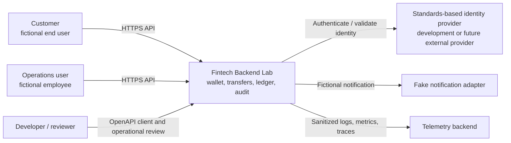

## 2. Initial runtime/container view

The modular monolith is one deployment boundary, with a worker added when asynchronous processing begins.

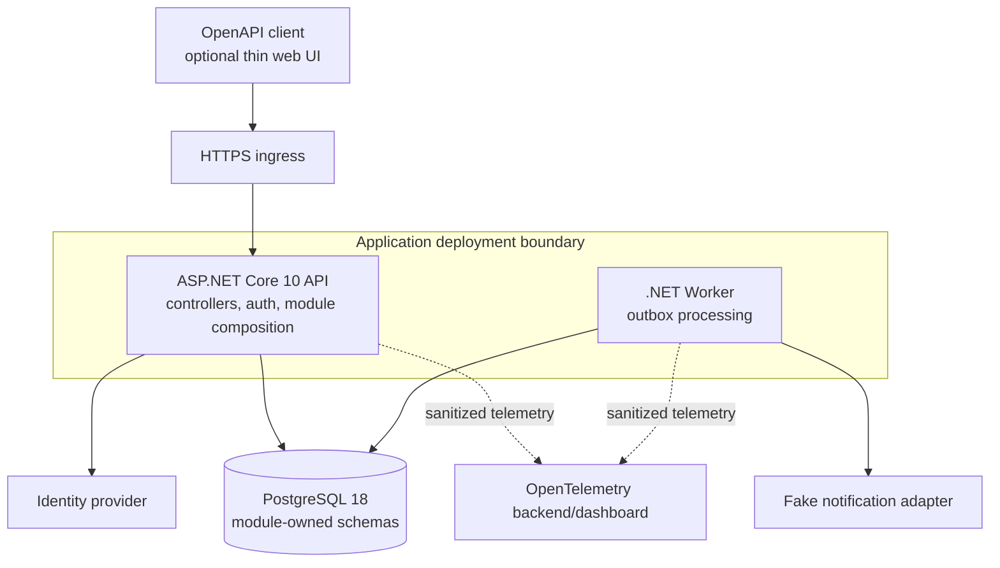

## 3. Module map and allowed business dependencies

Arrows mean “may depend on a public contract from.” Ledger deliberately does not depend on Payments.

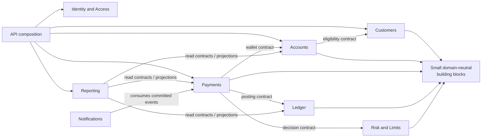

Forbidden examples: Ledger to Payments, Domain to API, one module's Infrastructure to another module's Infrastructure, and cyclic references.

## 4. Internal module structure

Dependencies point inward. Transport and infrastructure are replaceable details around domain/application behavior.

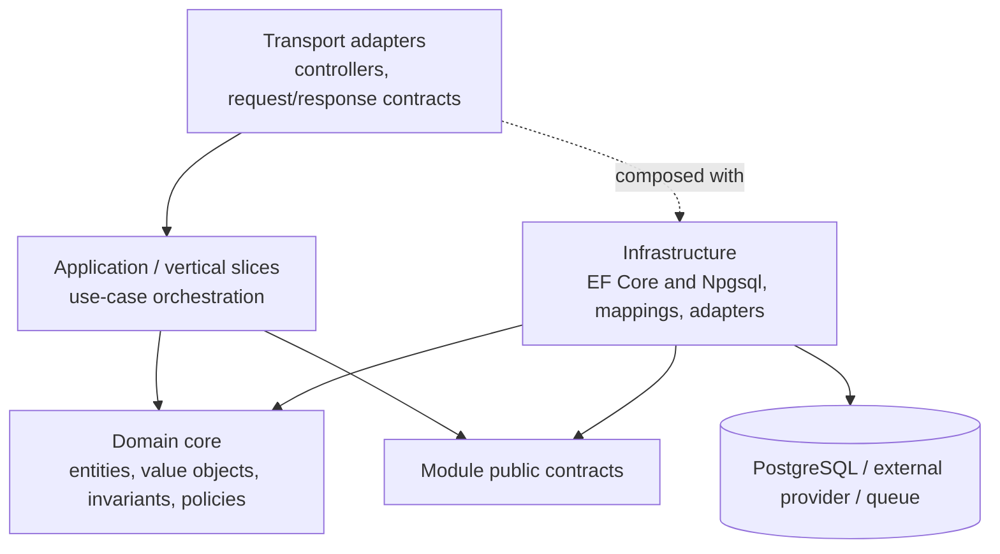

## 5. ASP.NET Core request path

```mermaid
flowchart LR
    Request[HTTPS request]
    Safety[Forwarded headers / HTTPS / request limits]
    Trace[Correlation and tracing]
    Errors[Exception handling / Problem Details]
    AuthN[Authentication]
    Rate[Partitioned rate limit]
    AuthZ[Endpoint and resource authorization]
    Bind[Model binding and boundary validation]
    Handler[Module use-case handler]
    Domain[Domain rules]
    Persistence[Module persistence / PostgreSQL transaction]
    Response[Documented response]

    Request --> Safety --> Trace --> Errors --> AuthN --> Rate --> AuthZ --> Bind --> Handler --> Domain --> Persistence --> Response
```

The exact middleware order is verified against implementation behavior; this diagram captures responsibilities, not executable configuration.

## 6. Successful internal transfer sequence

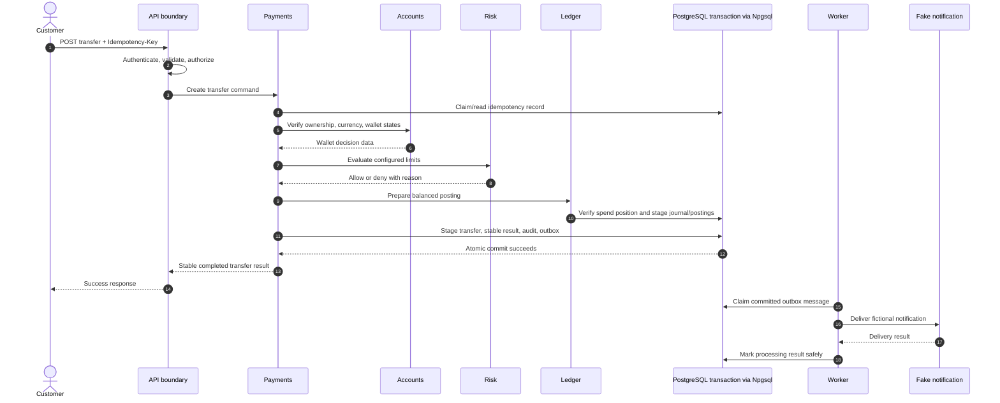

## 7. Transfer transaction boundary

Only the solid box commits atomically. Response transmission and asynchronous effects remain outside.

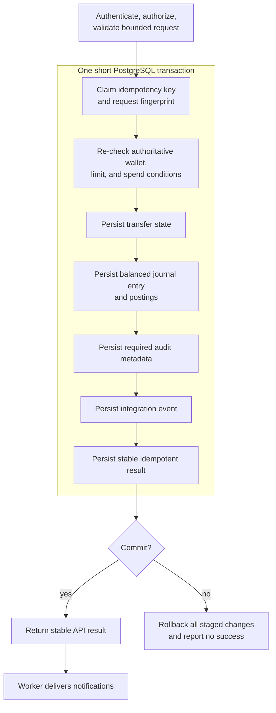

## 8. Idempotency decision flow

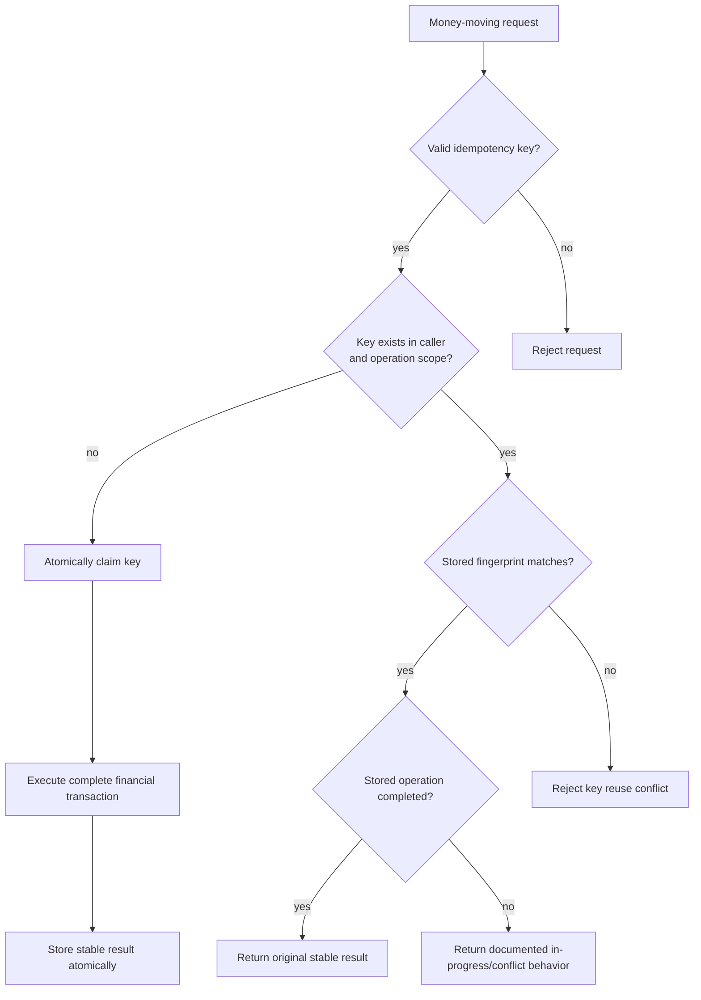

## 9. Transfer lifecycle

The final implementation may refine names, but transitions must remain explicit and auditable.

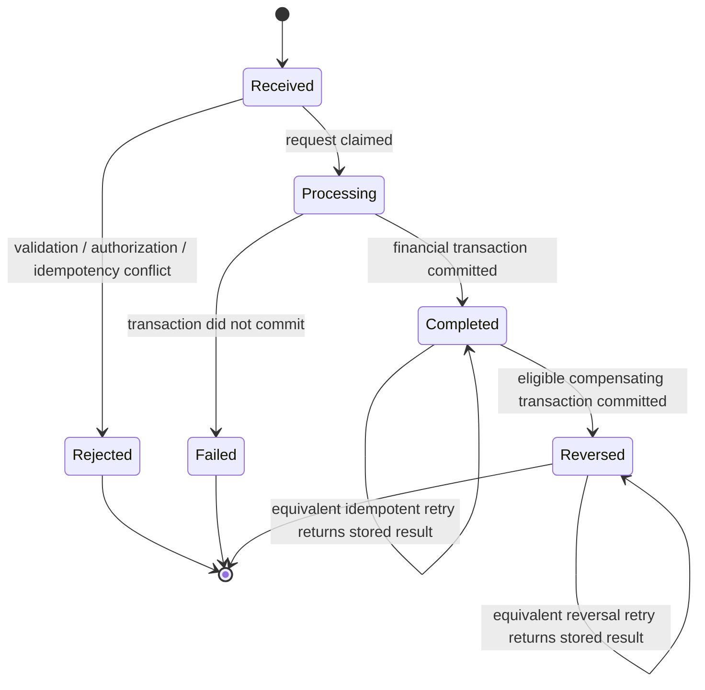

No externally observable `Completed` state is stored before the ledger transaction commits.

`Rejected` and `Failed` describe request outcomes in this view; they do not require a partially persisted transfer row. The implementation must document which non-financial diagnostic/audit evidence is retained without confusing it with a committed financial operation.

## 10. Double-entry examples

The signs are presented from the platform ledger's accounting perspective.

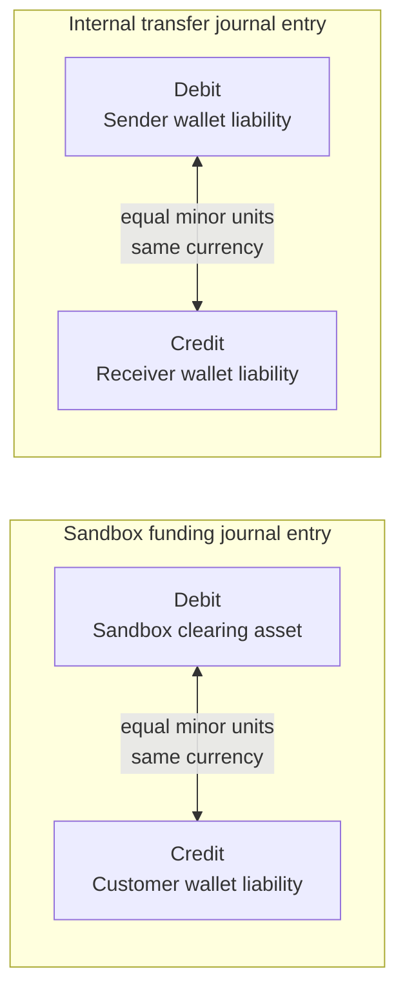

Every concrete accounting rule must be covered by tests and reviewed for the chosen chart of accounts.

## 11. Conceptual data relationships

Dashed business references across module ownership are represented conceptually; they do not automatically require cross-schema foreign keys.

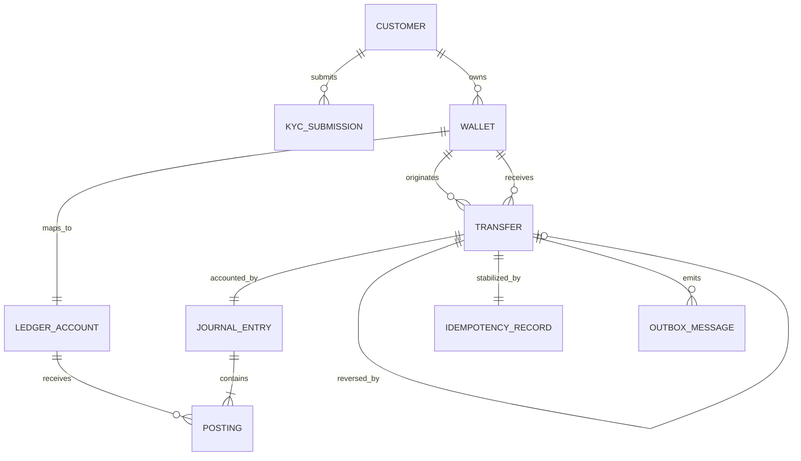

## 12. Module data ownership

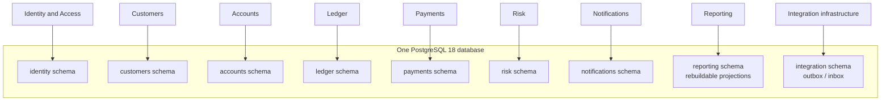

Each module writes its own schema. Cross-module behavior passes through contracts even though the schemas share one database.

Use explicit `snake_case` mappings and module-specific migration-history tables. Roles/grants and trusted `search_path` configuration complement these ownership boundaries; schemas alone do not isolate the modules. Concrete type conventions are in [Data Architecture](data-architecture.md#51-postgresql-type-mapping-baseline).

## 13. Outbox processing lifecycle

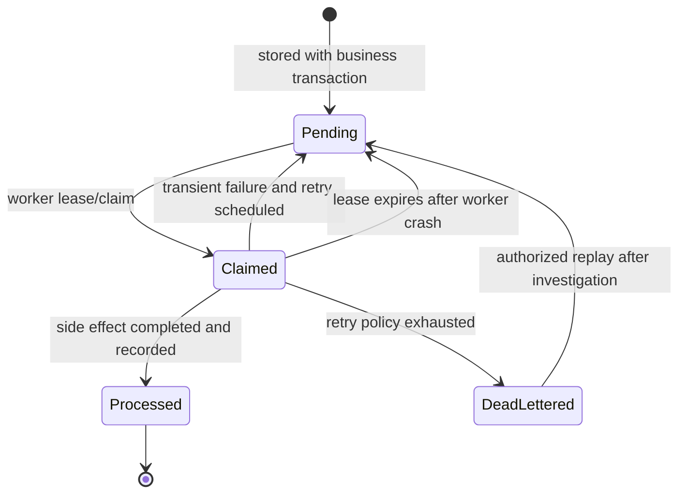

Replay is controlled and auditable. A duplicate delivery must be harmless.

## 14. Trust boundaries and principal flows

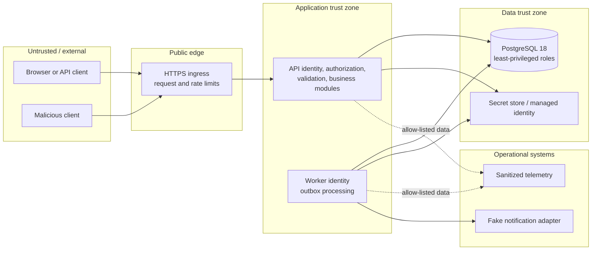

Every boundary crossing validates identity, authorization, shape, sensitivity, and failure behavior appropriate to that boundary.

## 15. Public sandbox deployment

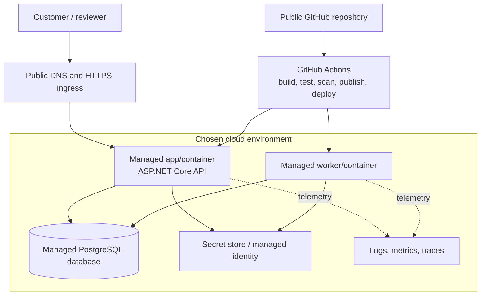

The final cloud service and credential model are selected in the deployment phase. This diagram does not imply a current deployment.

## 16. CI/CD and release flow

```mermaid
flowchart LR
    Change[Focused branch / pull request]
    Review[Human review<br/>requirements, diff, ADR]
    Verify[Restore, format, build,<br/>unit and architecture tests]
    Integrate[PostgreSQL integration, functional,<br/>concurrency and security tests]
    Scan[Dependency, secret,<br/>and code analysis]
    Artifact[Versioned immutable artifact]
    Stage[Staging deploy and migrations]
    Smoke[Smoke, reconciliation,<br/>observability checks]
    Approve{Release approval}
    Public[Public sandbox]
    Recover[Rollback or forward fix]

    Change --> Review --> Verify --> Integrate --> Scan --> Artifact --> Stage --> Smoke --> Approve
    Approve -->|approved| Public
    Approve -->|failed| Recover
    Public -->|release issue| Recover
```

## 17. Evolution path

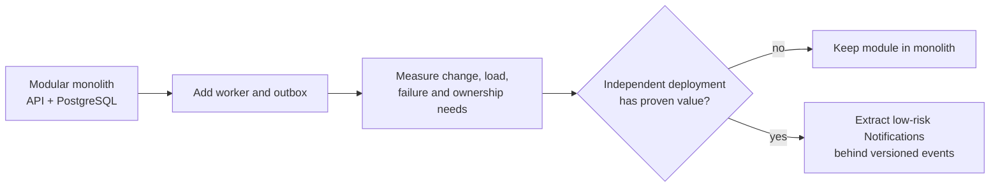

Ledger remains in-process unless extraordinary evidence justifies accepting distributed financial-consistency and operational complexity.

## 18. Diagram maintenance checklist

- Update context/runtime diagrams when a real external system or process is introduced.
- Update module map when an allowed dependency changes.
- Update transaction and sequence views when atomic state changes change.
- Update data views with module ownership and migration decisions.
- Update threat boundaries when hosting, identity, broker, or frontend design changes.
- Mark future/deferred elements clearly.
- Ensure diagram language matches the [Glossary](../glossary.md).
- Link the ADR that authorizes a significant change.
